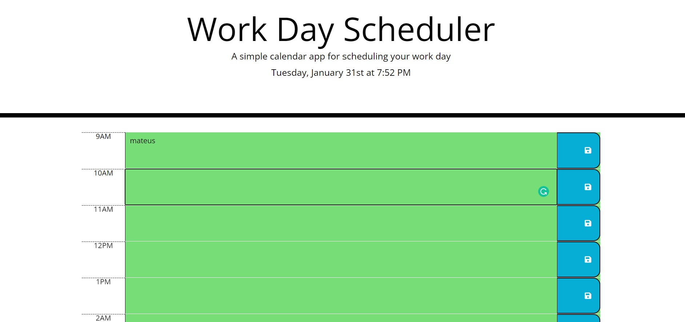

# simple-calendar

## Description

This Project was created to improve the skills and knowledge obtained through the bootcamp, this simple-calender: 

Display the current day at the top of the calendar when a user opens the planner.

Present timeblocks for standard business hours when the user scrolls down.

Color-code each timeblock based on past, present, and future when the timeblock is viewed.

Allow a user to enter an event when they click a timeblock.

Save the event in local storage when the save button is clicked in that timeblock.

Persist events between refreshes of a page.

## Installation

N/A

## Usage

## Credits

N/A

## License

Mit.
